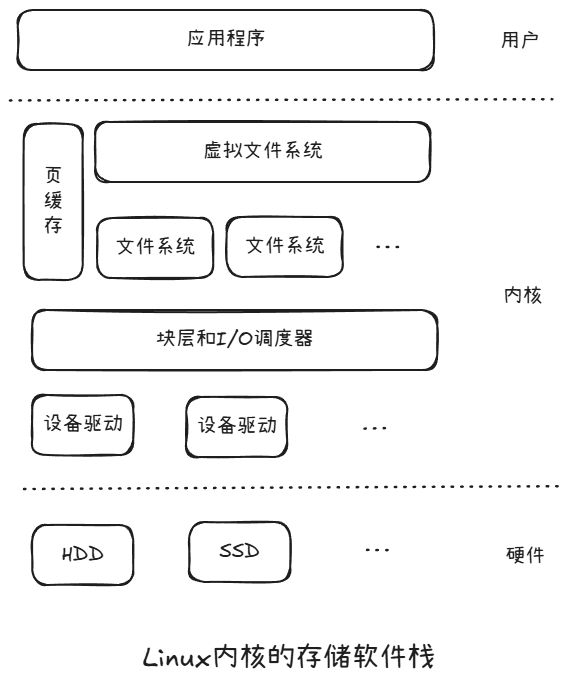
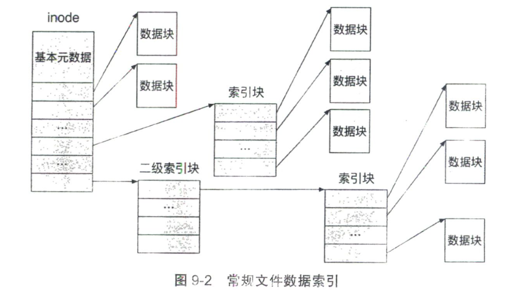
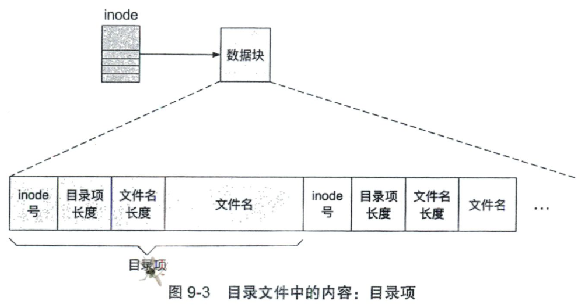
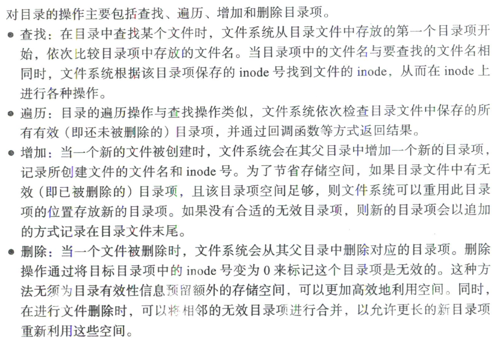
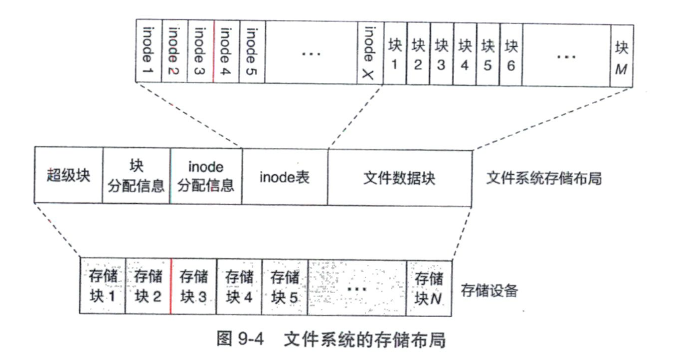
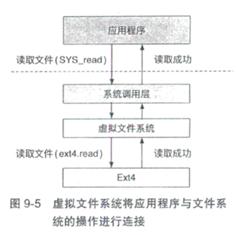

# 文件系统

## 概述

文件系统，对上层用户来说，提供文件操作接口，如open、read、write、close等。对下层的存储设备来说，文件系统以特定的格式在每个存储设备上维护组织文件数据和元数据。操作系统会将每一个存储设备抽象为块设备，方便文件系统使用统一的接口访问数据。

图为Linux内核的存储软件栈，以一个网络文件下载流程为例，当下载工具从网络中获取到文件内容之后，文件内容被暂存在下载工具的内存中。为了将这些数据持久保存下来，下载工具向操作系统发起一系列系统调用（如open和write等）。在处理系统调用时，Linux内核会调用其虚拟文件系统（Virtual File System VFS）处理文件请求。虚拟文件系统如同一个大管家负责管理具体的文件系统，并提供一系列服务，如页缓存（pagecache）、inode缓存（icache）和目录项缓存（dcache）等，Linux虚拟文件系统在解析用户的请求后，调用具体的文件系统的接口进一步处理请求。具体的文件系统（比如Ext4文件系统）会根据请求对数据进行读取或修改。当需要访问存储设备上的数据时，文件系统会创建对存储块的访问请求，并发送给I/O调度器。由于可能同时存在多个对存储设备的访问请求，I/O调度器根据预定策略对这些请求进行调度，以一定的顺序将请求发送给设备驱动。最终，设备驱动与存储设备进行交互并完成请求。在存储设备完成写入请求后，下载的文件便被持久保存到了存储设备之中。

## 基于inode的文件系统

### 知识点

- 基于inode的的文件系统如何保存常规文件，目录文件和其他类型的文件？
- 对每种类型的文件，有哪些操作，如何实现这些操作？
- 基于inode的文件系统，如何规划存储使用空间？
- 什么是硬盘格式化，为什么硬盘格式化后，空间少了？

### inode 与文件

**文件与inode一一对应**

一般，文件系统会将块设备上的存储空间划分为若干个存储块，大小一般为512字节或4KB。于是，一个文件就可以表示为这些存储块的集合，也就是记录这些存储块的索引，inode也就是index node，为了能够记录非常大的文件，比如4GB等，文件系统使用了类似虚拟内存页表的方法，使用多级索引，如下图所示。

另外，inode除了记录存储块的索引之外，还记录了文件相关的其他元数据，如文件模式、文件链接数、文件拥有者和用户组，文件大小以及文件访问时间等。

一个文件系统—般会支持多种文件类型，例如常规文件（regular file）、目录文件（directory file）和符号链接文件（symbolic link file）。不同类型的文件保存了不同种类的数据，在数据存储格式和使用方法上也会有所区别。

### 文件名与目录

文件与inode一一对应，但是文件名并不是与inode一一对应，当我们修改文件名或者文件的位置时，只需要重新做inode与文件名的映射即可，不需要重新修改inode，也就是文件名与具体的存储位置是解耦的。而文件名是存储在目录中的。

目录是一种特殊类型的文件，记录了文件名到inode的映射。目录中存储的是一种特殊的结构--目录项。每个目录项代表一条文件信息，记录文件的文件名及其对应的inode号，如下图所示：

注意：目录本身也是文件，因此可以通过递归，来结构化地组织文件系统中的文件。

注意这里增加和删除操作，对于目录项的变动。

### 硬链接和符号链接

硬链接：可以理解为shared_ptr，指向inode，每一个硬链接都可以对文件进行操作，只有当所有硬链接都删除时，文件对应的存储空间才会被删除。

软链接：有自己的inode，里面存储的是对应目标文件的路径，只有真正访问文件时，才会解析得到目标文件的inode（所以，目标文件是否存在，只有访问的时候才知道）。删除时，只是删除自身的inode，和目标文件没有关系。

### 存储布局

如图为一个文件系统的存储布局，当一个存储设备创建一个新的文件系统（格式化）时，文件系统格式化工具会根据文件系统的存储布局和存储设备的容量，计算每个区域的大小，并初始化区域中的元数据。

超级块：记录整个文件系统的全局元数据。包括魔法数字（操作系统根据魔法数字识别存储设备上文件系统的类型和存储布局），文件系统版本、空间大小、最后一次挂载时间和一些统计信息等。

块分配信息使用位图（bitmap）的格式标记文件数据块区域中各个块的使用情况。每个bit位对应一个块，比特位为1，表示对应数据块已经被分配和使用，若为0，表示对应数据块空闲。

inode表：文件系统中对inode的引用便是使用该表中存储的inode号，因为inode表在文件系统创建时已经固定，所以文件系统所能保存的最大文件数量也受此限制。

## 虚拟文件系统

计算机系统中可能存在多个文件系统（一台计算机多个硬盘，一个硬盘多个分区不同的文件系统等），因此，操作系统引入虚拟文件系统（VFS）对多种文件系统进行管理和协调，允许它们在同一个操作系统上共同工作。

如上图，应用程序向操作系统内核发出创建系统的调用请求，操作系统通过VFS调用ext4文件系统的“读取文件”方法，并最终将请求的结果返回给应用程序。
